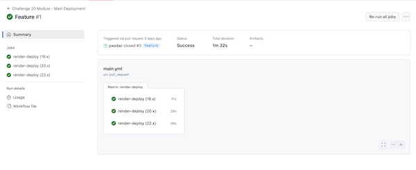
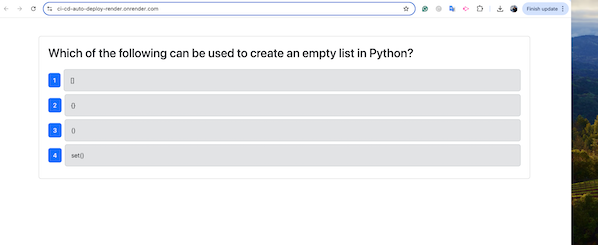

# CI/CD Pipeline with GitHub Actions

## Description

This project implements a **CI/CD Pipeline** using **GitHub Actions** for a full-stack application. The pipeline includes:

1. Automatic execution of component tests with **Cypress** when a Pull Request is created for the `develop` branch.
2. Automatic deployment of the application to **Render** when the `develop` branch is merged into the `main` branch.

## User Stories

- **CI for Automated Testing**  
  **As** a developer,  
  **I want** to automatically run Cypress tests when creating a Pull Request to `develop`,  
  **so that** code integrations are clean and meet the requirements.

- **CD for Automatic Deployment**  
  **As** a developer,  
  **I want** to automatically deploy the application to Render when merging `develop` into `main`,  
  **so that** the application is updated with major releases.

## Branch Structure

- `main`
- `develop`
- `feature`

## Deployed App

- [CI/CD AUTO DEPLOY APP](https://ci-cd-auto-deploy-render.onrender.com)

## Screenshots

### Test Results

### Successful Deployment

## Submission Requirements

- **URL of the functional, deployed application.**  
- **URL of the GitHub repository** containing:
  - Application code.
  - A high-quality README with description, screenshots, and links.

## License

© 2024 edX Boot Camps LLC. All Rights Reserved.
